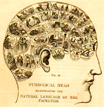

# 第一章 起点

## 1. 我们有可能把外语用得比母语更好吗？

能。

过去我跟你一样不相信。但，现在我信了，因为我这些年教出了太多这样的学生。我亲眼见证了太多这样在别人看来是 “奇迹” 的平常事件。

所有的多语使用者（multilingual）都一样，最终，在他们所使用的多种语言之中，总是有一个 “主导语言”（Dominant Language）。究竟哪一个是主导语言，并不取决于哪一个是母语，而取决于哪一个语言被使用得最多。

我自己从小就是双语使用者（Bilingual）──因为我是朝鲜族。韩文、中文，对我来说都是母语，反正从小都会，一样的流利。然而，随着日子的推移，由于在生活中使用中文的频度远远高于韩文，最终，对我来说，主导语言就是中文了──只因为我使用它是最多的。

在过去的五年里，我带出很多高中生。他们从高一（其中的一些稍微晚一些）就开始为了出国留学做准备。在保证在校课业的前提下，他们需要付出额外的努力，获得 TOEFL 高分，获得 SAT 高分，以便最终在高三毕业的那一年秋季漂洋过海到美国名校读书。我所接触的最早的那一批高中生，现在早已经本科毕业，绝大多数都在常青藤名校中攻读博士学位……

对这些人来说，从实际情况看，他们的主导语言可能早已不再是他们的母语，而是英文。因为在他们成长最为迅猛、获取知识信息最为集中而又丰厚的阶段里，他们所使用几乎全部是英文。事实上，在他们离开中国之前的三年里，他们的英语水平就已经远远超出其他人的想象──很多学生 SAT 成绩 2300 分以上：这样的成绩，即便是在美国人之中，也是属于百里挑一的[^1]。在到达美国之后，仅从他们的阅读量来看，就只能是越来越大而不可能越来越小，他们使用英文的频率和中文的频率，尤其是在听说方面，早已经拉开差距。

甚至，他们之中的一些人（不见得是少数），从入读美国名校的那一刻起，就开始学习另外一门外语，比如法语、西班牙语、德语等；而两三年之后，他们已经可以熟练地使用 “第三语言” 听说读写……

我在国内大学举办讲座的时候，常常提起这些学生，而台下很多为了四六级考试苦苦挣扎的学生往往向我报以怀疑的态度：“切，谁信啊？”，“怎么可能呢！” 我理解。对他们来说，这种事情是绝对不可能的──尽管，那只是他们觉得不可能而已。

“我们能把外语用得比母语更好吗？”

这个问题的答案是 “能”。

而这仅有一个字的答案非常重要。

尽管不是每个人都能做到，但，“能” 或起码 “有可能” 这个事实，会改变一切的，至少可以改变一些人的一切。这就好像总是有一小部分人会真正明白：1 和 99 之间的差别再大，也不如 0 和 1 之间的差别大。

知道这一个字的答案，很可能就是一些人重生的起点。

[^1]: 读者有兴趣可以到 collegeboard.com 上查看一下官方的[SAT Percentile Ranks](http://www.collegeboard.com/prod_downloads/highered/ra/sat/composite_CR_M_W_percentile_ranks.pdf)

## 2. 可为什么大多数人就是学不好？

“学了这么多年，怎么却越学越差……”

这是我当初的困惑。多年来四处巡回演讲、授课，也让我知道很多很多人都有只多不少的共鸣──我并不孤独。

为什么我们竟然越学越差？

因为我们从未相信自己能够学会、学好！

更令人在想明白之后不寒而栗的是：我们甚至可能并不知道 “我们从未相信过”。

骨子里我们中的绝大多数人从来都不相信我们能够学好一门外语──更不用说多种语言。那些精通多种语言的人，在我们眼里都是天赋异禀的人，“和我们普通人不一样”。

尽管在过去的许多年里（小学六年、中学六年、本科四年……）我们一直都在 “努力” 学习英语，可事实上收效甚微。一旦肯坦然面对，每个 “努力学英语” 十数年而不得的人都会承认：这些年其实真正学习的时间少之又少。

一方面是确实知道英语这东西非常有用所以最好能够习得，一方面又是因骨子里不相信自己确实能够习得而造成实际上并不努力，而还有一方面是这两个截然相反的观念导致学习者焦虑和无奈。

究竟是什么使得我们 “从未相信” 呢？究竟是什么让我们 “从未相信” 而又并不自知呢？

也许有很多原因。但我们的中学英语课本绝对是罪魁祸首（起码是之一）。在我们国家，高考英语词汇大纲，基本上由 3500 个左右的词汇构成。由于区域的不同，教材不同，我们姑且往多了算一点，算它 3600。尽管我们并不知道这个数字给我们带来的影响究竟是什么，但不可争辩的事实是，我们确实知道这个数字──起码知道个大概。

高中毕业之前，我们至少学了 6 年的英语──小学和幼儿园姑且不算数。那这意味着什么呢？3600 这个数字告诉我们，每年我们能够习得 600 个英文单词就可以了──如果真的做到了的话，那么在高考的英语考试中，成绩必然名列前茅 …… 一年有 365 天，那平均每天学多少个单词就够了呢？不到 2 个就够了……

高考词汇大纲里的英文词汇数量，悄无声息地向每一个孩子传递着这样的消息：
1. 英语很难很难……
2. 你很笨很笨……
3. 一天能学两个单词就很了不起了！

嗯。就是这样。

2010 年春天，我完成此书的初稿。当时我还觉得很难向读者简洁明了地把这个道理讲明白说清楚 。幸运的是，2010 年秋天，好莱坞的导演克里斯托弗•诺兰拍了一部誉满全球的大片──“Inception”（中译 “盗梦空间”）。这个片名（直译为 “植入”）成为众人皆知的概念。这帮了我一个大忙！诺兰在电影里向观众交代：一个想法必须足够简单才可能被植入；越是简单的想法，在植入之后越是根深蒂固；因为拥有这个想法的人无法分辨这个想法是自己的还是被植入的 …… 同样的道理，高考词汇大纲就是以这种方式，把那个极为简单的想法悄悄地 “植入” 到我们的大脑之中，进而使其根深蒂固，影响我们一生……

很多的时候，**人傻是被教出来的**。教育这东西，从来都是在失败中发挥作用──所以成功必然是偶然。教育的古怪之处在于，如果把学生当做天才去教育，学生几乎注定不会成为天才，因为天才是靠自学的；但是，如果把学生当做弱智去教育，那学生肯定会变成弱智──因为人傻是被教出来的。

还好，谁都有自学的权利，而事实上，无论是谁都多多少少有一定的自学能力。更好的是，有一些知识是可以瞬间点透并发挥作用的。之前的一节，回答了这个问题，“我们有可能把外语用得比母语还好吗？” 答案是 “能”。知道这个答案的意义就在于它能够把之前被植入的想法斩草除根。

## 3. 为什么另外一些人却 “轻松” 学会了？

与 “越学越差” 的人相对，有一些人，也许是少数，却轻松地学会了，学好了──正如我之前提到的那些已经在美国名校读书的 “幸运儿” 们一样。

问题在于，他们也被植入了同样的想法──他们也在国内的高中读书，他们用的也是同样的教材，在同样的课堂里上课，遇到的是同样的英语老师 …… 那为什么他们没有受到影响呢？

答案是，他们被植入了另外一种想法，尽管他们自己可能并不知道实情。
这些学生绝大多数都是成长在中国的都会城市中，在那些城市里，都会至少有一个提供 TOEFL/SAT 培训的机构。 

这类培训机构存在的本身，比它们的 “教学质量” 更重要。这类培训机构在不停地向外散播一个消息：有一个考试叫 TOEFL（这两年它们又让更多人了解到另外一个考试，叫 SAT），很多人去学，很多人去考，最终也有很多人获得了高分（至于得到消息的人是否在这里犯了逻辑错误并不重要，重要的是，连这种错误的逻辑关系都是向外传递的强大信息的重要组成部分[^2]）……更为重要的是，那些去学、去考、最终获得高分的人就在身边；而人们看到 “甚至还不如自己 [^3]” 的人去学、去考、最终获得高分的时候，采取行动就是自然而然的了。

换言之，“这种培训机构的存在” 这个事实本身对学生来讲可能要比 “去某个培训机构上课” 更有意义、更有影响。这不是我自己的理论，事实上，在国外有种专门的课程，叫做 “Power of the place”──地理学的一个分支，专门研究这种机理及其影响。

这就是观念的力量。如果你不知道 TOEFL 考试的存在，你甚至没机会去参加那个考试。如果你不认为那是个有可能获得高分的考试，那你甚至可能根本不会尝试去努力。仅仅因为你知道了它的存在，你就有可能开始努力；仅仅因为你看到 “甚至还不如你的人”（尽管这很可能干脆就是个幻觉）获得了高分，你就没有理由不去努力，最终你也有可能获得高分……

事实上，“**我也行**” 这三个字是绝大多数普通人最现实最有效的动力。在像习得第二语言这样基本上不需要依赖天赋的领域之中更是如此。

[^2]: 人们常常误会因果关系：他们看到别人先去参加某个培训，后来获得了高分，于是就认为“那个培训班”和“获得高分”之间是因果关系；这和“认为鸡叫唤起了太阳”本质上没什么两样。

[^3]: 人们总是倾向于高估自己。比如，有一个有趣的调查发现，70%以上的司机认为自己的驾驶水平处于中等以上。所以，“甚至还不如自己”很多的时候只不过是一个幻觉。

## 4. 观念是如何影响我的？

观念的力量有时如此之大，乃至于某个观念上的一点点改变，就可能够改变一个人的一生。

穿透表象深入实质并不像说起来的那么容易。历史学家们许多年的研究过后才达成共识，当初打败印第安人的并不是欧洲人的先进军火，而是欧洲人身上所存在的、那无论是当时的欧洲人还是印第安人都看不见摸不着的病毒打败了印第安人，使他们成群地病倒、死去，使当时的欧洲人看起来 “有如神助” ……

所以，很多时候问题的实际根源与那显而易见的表象之间总是相去甚远。而观念的力量在我个人身上也有过一次戏剧性的体现。

大约二十年前（1988 年前后）我刚上高中。我父亲的教研室里 有位教英语的副教授去考了一次托福，成绩是 570 分（满分 677 分）。大家提起这事儿的时候都说，“这个成绩已经不错了！”（因为之前有另外一个教授去考过，是 530 分……）尽管我不懂那是什么样的考试，但留下了个印象：这是个很难的考试。

又过了好几年，1993 年，我读大三。隔壁班的一位同学据说要考托福。现在想来，当时在北京读书的大学生们都在如火如荼地准备这个考试，可是当时的长春，根本没有人知道这个考试。在那里，我就算见多识广的了。某天晚上回到寝室大家提起这件事儿的时候，我就给大家讲了讲托福考试有多难。大家听到大学老师也只不过考了个 570 分的时候，吐了吐舌头，都说，“这干脆就不是人考的么！” 之后，大家给那位同学起了个外号——“牲口”。

那一年夏天，我到北京找在清华读书的一个高中同学，请他学计算机的同学为我攒一台 486 电脑。路上走过一处平房的时候，他指着那房子说，“那就是新东方”。他的口气就好像是我应该知道一样。于是我问，“什么新东方？” 他告诉我那是个英语培训机构，要出国，就到那里参加培训。据说大学生都在传：“去那里不一定能打高分，但是不去那里肯定打不了高分。” 转瞬间这个话题就过去，我们接着聊了些什么，现在的我早已经没有了记忆……

许多年后，我在新东方教书好几年之后的某一天，我才突然记起，实际上很多很多年前，俞敏洪同学还处于创业阶段的时候，我其实就听说过新东方……
而当时寝室里的讨论，很快就被同学们忘得一干二净。我现在甚至不大记得那位同学的名字。当然更不知道他托福究竟考了多少分，但他第二年去了美国，这我倒是知道的。

2000 年年底，已经从大学毕业多年，期间做销售、做批发赚了很多钱，后又在家陪父亲养病而花光了积蓄的我，急需一份稳定的工作。后来有个高中同校的朋友从北京打来电话，说，“笑来，来北京吧，到新东方教书，收入不错。” 这时我早已忘了六年前曾经听北京的同学提过新东方，只是问他，“收入确定不低吗？” 朋友说，“放心，以你的口才，肯定没问题！” 我就这样坐火车到北京，到新东方报了一期班；又在新东方的门口费力买来各种题集，而后把自己关在海淀区双榆树的一个 11 层的一居小房子里四个月时间，考了托福、考了 GRE，拿着变态成绩去新东方应聘。而后一口气那里教了七年。期间，新东方教育科技集团在美国纽约证交所上市，代码为 EDU。

2003 年，《托福核心词汇 21 天突破》 出版发行的那天，我请客， 一大堆朋友闲聊，不知怎么一下子想起来 1994 年（那是已经是大约十年前了）我去中关村攒电脑时路过新东方旧址的情形，进而又一下想起来那个被我们起了外号叫 “牲口” 的同学，不禁打了个寒颤。

这个寒颤之前，我一直觉得自己 2000 年以 28 岁的 “高龄” 把自己关到一个小屋子里四个月就搞定托福、GRE 高分是一件值得自吹自擂的事情；可是这个寒颤之后，我突然发现我其实 “很傻很天真”（1993 年）的时候，就有机会去考托福、GRE，可当时竟然以为那是 “不可能” 的事情；还自以为是地与其他同学一样叫那位同学 “牲口”……如若那年我去准备托福、GRE 考试（而不是 28 岁那年 —— 七年之差啊！），现在想来当时若以我还在学校的聪明脑瓜，也许不用四个月（可能三个月？）就能搞定高分。如若真的如此，此后的人生岂不是天壤之别？现在想来，那是我的心智简直就是 “畜生”，不禁暗自虚汗犹如大雨磅礴 。

我经常把我的这段经历讲给我的学生听。人就是这样，大道理听多了到最后都听不进去，看得见摸得着的真实例子才会打动他们。这些年来，我知道我的这段经历给身边很多的学生带来了足够的触动，改变了一些人，改变了一些其他我并不知道的什么。

## 5. 这样的结论是否有理论依据？

GRE 考试中有一作文题目 ：

> "No field of study can advance significantly unless outsiders bring their knowledge and experience to that field of study."

> 除非有外来者带来其它领域的知识与经验，任何一个领域都不可能大幅度进步。

尽管这话并非永远成立，但它确实是常常发生的现象。比如，这是一本关于第二语言习得（英语学习）的书，却需要从别处开始说起。

约翰霍普金斯大学的两位研究人员 David Hubel 和 Torsten Wiesel 于 1959 年年底开始做的一项实验在其后的许多年里，影响了全球不计其数的第二语言习得者 —— 只不过，这影响主要是负面的 —— 尽管该实验本身的目的与外语学习看起来没有什么直接联系：研究动物视觉系统的早期发展 。

> 他们将出生几个月的猫或者猴的一只眼睛用手术缝合；经过一段时间之后再重新打开。研究表明，即便后来重新打开缝合的眼睑，这些动物的眼睛也不能再获得视觉功能。在这段时间内关闭一只眼睛对于动物脑中视觉区域的结构有明显的影响。但是，对于成年猫进行同样时间或更长时间的视觉剥夺既不会影响它们的视觉能力，也不会影响它们的大脑结构。只有年幼的动物在它们发展的“关键期”（Critical Period）才会因此剥夺视觉敏感。

> 

> youtube上有这个实验的记录片：
> * http://www.youtube.com/watch?v=IOHayh06LJ4；
> * http://www.youtube.com/watch?v=KE952yueVLA

这项研究及其成果最终使这两个人于 1981 年获得了诺贝尔医学奖，“因为这项研究对理解视觉系统如何处理信息有着巨大贡献”。但是，人们好像对这项研究中提出的 “关键期” 概念更感兴趣。科学家们很快就发现大脑的其它部分也都需要获得刺激才能够发展，并且好像它们都符合关键期理论。而根据关键期理论，只有在关键期内，大脑才是 “可塑的”（Plastic），这时大脑所接受到的外部刺激甚至会改变大脑的结构；而关键期过后，大脑就不再是可塑的了。很快，“关键期” 这个概念延伸到了各个科学领域。

语言学家 Eric Heinz Lenneberg 出生于德国，二战时期逃亡巴西，后移民美国，先后就读于芝加哥大学、哈佛大学。后作为心理学和神经生物学教授，曾在哈佛大学医学院、密西根安娜堡大学以及康奈尔大学医学院任职。Lenneberg 教授在 1967 年提出 “语言习得关键期假说”（Language acquisition Critical period hypothesis），认为语言习得的关键期始于婴儿出生，止于从八岁到青春期结束之间的某一时刻。“关键期” 过后，习得第二语言的能力将大幅度下降，并且没办法去除来自母语的口音影响。

事实上，Lenneberg 教授相当谨慎，提出的是个 “假说”（Hypothesis）。可是，几乎所有的科学研究结果一旦进入大众传播领域，或多或少都会掺杂着误解，甚至被故意歪曲。比如，当年宾夕法尼亚大学的 Martin Seligman 教授的 “Learned Optimism” 提出之后，瞬间就被成功学大师们拿去当作自己手中的道具，全然不顾 Seligman 教授所持的保留态度及其严谨。同样，Lenneberg 教授的 “假说” 到了市场上，就变成了 “理论”（Theory）。原本的 “始于婴儿出生，止于从八岁到青春期结束之间的某一时刻”，也变成了 “始于 0 岁，止于 10 岁”——在大洋另一端的中国，这几乎成了所有少儿英语项目的主要宣传工具，其潜台词的目的不过是恐吓家长赶紧交钱，“否则就来不及了！”。
更为普遍的是，这个 “关键期理论” 成了很多人安慰自己的借口。学不好是正常的，因为 “关键期早就过了么！” 或者 “不是小时候学的就不行……” 再或者 “都这么大岁数了，没戏了！”，等等。

其实 David Hubel 和 Torsten Wiesel 的真正贡献在于他们证明了大脑是 “可塑” 的，而非一成不变的。而他们两人的局限恰恰在于人们津津乐道的 “关键期”。当时，他们俩还是 “区域论” 的坚定支持者──而区域论，很久之后才被学术界推翻。

区域论（Localizationism）认为大脑就好像是一台复杂的机器，而这个机器的每个部件都有其特定的功能；进而，每个特定的功能都是受硬件限制的（Hardwired）。而区域论的言外之意则是，一旦大脑的某个区域损坏，那么那个区域所管辖的功能就无法恢复了。而临床观察也好像确实能够印证这个结论：比如，中风[^4]患者的瘫痪肢体看起来是无论如何都无法恢复的。

很漂亮的一个男孩，是不是？注意到了么，他的眼睛？这不是特效，这男孩的眼睛就那么亮。这个男孩是海洋吉普赛人（Sea Gypsies），他们的眼睛都这么亮。

海洋吉普赛人生活在泰国西海岸附近，属于游牧民族，只不过，他们以捕食海鲜为生。他们生命中的绝大部分都漂流在海上。这个男孩就是在海上出生的。他 们在学会说话学会走路之前就能够学会游泳。他们可以在不使用任何设备的情况下轻松潜入水面 30 英尺以下 —— 有个叫做苏鲁的部落，他们常常要潜到 75 英尺之下去采珍珠。他们能够控制并降低自己的心率，进而控制自己的氧消耗，他们可以在水下滞留很长时间，往往两倍于普通人以上。

当然，最令人惊讶的是他们的眼睛。他们可以在水下保持良好的、甚至更好的视力。因为他们学会了如何控制自己的瞳孔尺寸，能够把瞳孔缩小 22%。而一直以来，人们认为瞳孔的收缩尺度是固定的（由人类的基因决定的），并且应该是不受意识控制的，受制于 “自主神经系统”。

科学家们认为，这不是 “基因突变” 的结果，而是大脑的 “可塑性”（Plasticity）造成的。因为科学家 Anna Gislen 以及她的同伴把海洋吉普赛人带到欧洲，很快就教会了一群瑞典孩子如何收缩瞳孔。现在科学家们相信，大脑的可塑性极强，并且从始至终一直存在着这种可塑性。一切来自外部的刺激（尤其是系统 的训练）都会对我们的大脑产生影响，而大脑的结构和功能都会随之发生变化。

古人观察说，“非我族类，其心必异”。从这个意义上是正确的，因为由此看来，文化这个东西显然在不停地塑造受这个文化影响的人们的大脑。一直以来被 认为是 “硬件” 局限的问题，现在已经清楚地被证明（至少部分是）是 “软件” 开发问题。我们的大脑就好像一台神奇的计算机 —— 因为它的硬件甚至有能力去 “适应” 安装进去的 “软件”。

之所以科学家们推断说海洋吉普赛人的 “特异功能” 不是 “基因突变” 的结果，主要根据来自两个方面：

1. 研究表明，几万年以来，人类大脑的构造几乎没有发生过任何变化；
2. 这种能力是在一代人之间就可以学会的，无需遗传积累。

 近一百年来，全球各地都发现了大量的 “洞穴壁画”（Cave Painting）。经碳同位素分析，这些壁画最久远的是三万年前的作品，最近的也是约一万年之前的作品。而这些作品往往让现代画家们惊讶，甚至沮丧。毕加索在 1940 年参观当时新发现的位于法国多尔多涅镇的 Lascaux 洞穴之时，看到这些壁画（上图是其中之一），多少有些失落，提起所谓现代艺术，评价道 “我们其实啥都没学会。[^5]”
 
事实上，这并不是坏消息。相反，它恰好是最好的好消息。几万年前人们能够做出这样神奇的作品，说明那时人类的大脑就拥有足够的潜力，而今天我们的发展和进步，某种意义上就是开发这种潜力的结果。

Anna Gislen 让一群欧洲孩子在八个月内就学会了像海洋吉普赛人一样收缩瞳孔，[^6]证明了这种能力并非由遗传获得。也许大多数人看不出这个证明的具体现实意义，但是对于第二语言习得者来说，这无疑是意义非凡的发现。一直以来，科学界就存在着争论：“语言能力到底是不是天生的？”

其实，根本无需争论。很显然，语言能力并非天生的，而是后天习得的。事实上，语言文字的出现迄今为止也不过几千年而已，之前的人类大脑并非没有能力处理语言文字，而是没有语言文字可供处理。事实上，科学家们早就发现他们可以在一代之间就能教会那些原始部落的人使用 “新” 的语言和文字。而我国的扫盲工作，本质上来看也是一样的道理。与其他动物相比，人类的语言能力更强是因为大脑容量更大，潜力更广。很多科学家都成功做到教会猴子或者其他动物一些人类的语言──只不过，它们记忆力太差，潜力有限，所以不大可能达到人类的境界而已。

如果说，1) 大脑是可塑的；2) 语言能力是后天习得的，那么理论上来讲，任何人都可以习得任何语言才对。可事实上看起来并非如此。而 “关键期” 理论又给希望蒙上了一层阴影。因为按照关键期的说法，大脑只在最初的一段时间里是可塑的。不过，二三十年之后，终于有科学家证明：

1. 大脑是可塑的；
2. 并且它自始至终都是可塑的；
3. 甚至它还会重新组织自己（Reorganizing），通过恰当的训练，它能用另外一个区域习得已被毁坏区域的能力……

只不过，这个证明过程格外地不顺利。
请读者猜猜下图中，这个正在[美国UAB康复中心]( http://www.uabhealth.org)治疗的小女孩受伤的是左臂还是右臂？

其实她的左臂没有受伤，而之所以把左臂固定起来就是因为那是一条没有受伤的手臂，而右臂才是受伤、需要通过训练恢复的 …… 咦？这是怎么回事儿？可是从生理上来看，大脑受损的部分是没办法恢复的，她又怎么能通过训练来让已经受伤的右臂恢复正常呢？ 

大脑的神奇之处在于它可以利用其它未受损的部分重新习得受损部分的功能（学术上叫做 “remap”、“reroute”、或者 “rewire”）。之所以要把行动自如的左臂绑起来，是因为如果不这么做的话，面对任何需求，大脑中负责控制左臂的部分（或称为 “左臂脑图”）都会 “优先启动”；因为这部分是未受损的，而原本控制右臂的部分已经受损了。换言之，这时，大脑中尚不存在一个能够控制右臂的部分。而把左臂固定住之后，尽管负责控制左臂的大脑部分依然 “优先启动”，但实际上却无法自如操纵左臂。而在这种情况下，就可以通过让大脑的其他部分慢慢专注于右臂，进而习得控制右臂的方法 —— 即，可以通过这样的训练，慢慢使大脑未受损的某个区域 “习得” 原本只有那个已经受损的区域所负责的功能。没有多久，这个女孩子的右臂就恢复了，活动起来与原来没什么两样。可是她的大脑不再是原来的样子了，尽管某一部分受损且不可恢复，但她大脑的另外一个区域已经被开发，能够别无二致地完成受损区域曾经可以完成的功能。

仅仅在 2004 年之前，这种疗法是完全不可想象的。这种最初看起来匪夷所思的疗法叫做 “CI 活动疗法”（Constraint-Induced Movement Therapy，简称 “CI” 或者 “CIMT”）的发明者是[Edward Taub](http://en.wikipedia.org/wiki/Edward_Taub)教授。今天，这种疗法渐渐开始在全世界范围内普及，帮助无数偏瘫[^7]患者找回原来的自我和生活。可是 Taub 教授的研究经历却一波三折。为了找到偏瘫的资料方案，他需要人为地使猴子偏瘫（故意破坏猴子大脑的某个区域），而后再想办法通过训练另那些猴子从偏瘫状态中恢复过来 …… 上个世纪八十年代初，他被一个动物权益保护组织告上法庭，导致实验室被关闭，经费被冻结，最后甚至失去了工作，几乎所有的人都对他避之唯恐不及。接下来的六年时间里，Taub 教授的所有时间精力都被耗费在为自己辩护上 —— 巨大的社会压力使得他甚至找不到愿意为他辩护的律师，所以他只好自己做自己的律师。案发之前，Taub 教授总计有大约 10 万美元的存款，到他最终胜诉洗清所有罪名之时，他只剩下了大约四千美元的积蓄。当然，时至今日，基于他的理论及其实践为人类创造的巨大价值，Taub 教授被公认为当今全球最杰出的科学家之一。

Taub 教授 CI 疗法的成功首先证明区域论是错误的（至少不是完全正确的）——大脑可以重新组织自己；其次证明大脑自始至终都是可塑的，甚至可以重组 —— 即，用一个新的脑图完成原本由受损的脑图完成的功能；最后证明的也是最重要的：脑图之间存在着相互竞争 —— 所以，为了治好受损的右臂，要先把未受损的左臂给限制住。如果不把未受损的左臂给限制住的话，那么左臂的脑图将永远处于优势，进而，使得大脑对已经受损的右臂产生 “习得之弃用”（Learned Nonuse）[^8]。

这最后一条可以用来清楚地解释原本用 “关键期论” 错误地解释的现象：为什么成年后学习第二语言显得更为困难？

成年之后，第二语言学习显得更为困难的原因并不在于关键期论所说的 “此后大脑不再可塑”，而实际上在于这是第二语言所使用的脑图要与已经形成强大势力的母语脑图竞争 —— 当然越来越难[^9]。然而，恰恰是这样的认识给了人们希望。目前，有很多教育学家开始提倡 “浸泡式学习”，有一定的依据，也有相当的效果。所谓 “浸泡式学习”，就是在特定的时间、特定的环境里，强迫学生只使用第二语言，禁止使用母语，进而刺激大脑加速构建新的脑图。风靡全球的罗赛塔石碑语言学习软体（[Rosetta Stone](www.rosettastone.com)）就是基于这个原理开发出来的。

对于第二语言习得者来说，最直观、最有意义的好消息是：
1. 什么时候开始学都不晚；
2. 只要方法得当，并加以时日，一定能学好。
3. 甚至，第二语言也可能超越母语成为主导语言。

（当然，接下来的内容中，读者会知道有一个比 “学” 更好的方法……）
在学习这件事儿是，相信自己一定能学好，并不一定保证真的能够学好；但是，反过来，如果相信自己不可能学好，那最终真的就不可能学好。所谓 “自证预言”（[Self-fulfilling prophecy](http://en.wikipedia.org/wiki/Self-fulfilling_prophecy) ）就是这样，总是在负面起作用。事实上，“语言习得关键期” 之说四十多年来在全球造成了难以估计的恶果，不计其数的人在不经意之间把 “假说” 当成了 “定论”，相信自己不可能学好，进而成为 “自证预言” 注定的受害者。

“我没天分”、“我就学不好”、“英语太难了” 之类的话，甚至这类的念头，其实都是强大的诅咒。它们有着既强大又邪恶的力量。观察一下身边的人，你会惊讶地发现很多学了英语很多年的人，说得最流利发音最标准的一句英语竟然是：“I’m sorry, my English is poor…” 如果还有前缀的话，要么是 “(I beg your) Pardon…” 或者就是用错的 “Excuse me…”……从这样的例子里我们就可以看到那 “诅咒” 的强大和无所不在。

[罗伯特•莫顿](http://en.wikipedia.org/wiki/Robert_K._Merton)教授发现了这个现象，为这类现象取了个名字叫做 “自证预言”（Self-fulfilling prophecy）。

> 当人们相信某件事情会发生（事实上那件事情原本并不见得一定会发生），那么此事最终真的会发生。

西方神话里充满了这种故事：

> 底比斯（Thebes）国王拉伊奥斯（Laius）与王后约卡斯塔（Jocasta）生下俄狄浦斯之后得到神谕说，这个孩子会终究会弑父娶母。为了躲避厄运，拉伊奥斯刺穿了新生儿的脚踝（oidipous在希腊语中的意思是“肿胀的脚”），令牧人将孩子丢弃在野外等死。

> 可是牧人于心不忍，于是，就把孩子偷偷送给了柯林斯（Corinth）的国王波吕波斯（Polybus）。波吕波斯很喜欢这个孩子，就把他当作亲生孩子抚养。俄狄浦斯长大之后，从神殿得知神谕，了解到自己最终会弑父娶母；而他却不知道国王波吕波斯与王后并非自己的亲生父母。为了避免神谕成真，他便离开柯林斯并发誓永远不在回来。

> 后来，俄狄浦斯在流浪的过程中，在一个岔路口与一群陌生人发生冲突，失手杀死了人，而其中就有他的亲生父亲拉伊奥斯。而此后又因为解开了狮身人面兽斯芬克斯（Sphinx）的谜题而继承了底比斯的王位，娶了国王的遗孀为妻。

> 俄狄浦斯登上王位之后，底比斯不断发生灾祸，包括瘟疫。于是俄狄浦斯求助于神祇。先知提瑞西阿斯（Tiresias）揭示之后，俄狄浦斯才知道他是拉伊奥斯的儿子，弑父娶母的不幸命运最终应验。震惊不已的约卡斯塔羞愧地上吊自杀，而同样悲愤不已的俄狄浦斯，则刺瞎了自己的双眼。

而莫顿教授用银行挤兑的例子说明自证预言的作用机理：

> 一家银行本来运作得好好的，但不知怎么就开始有谣言说这家银行要倒闭了。流言越穿越广，越来越多的人开始信以为真，开始有人跑到银行把自己的存款提走；进而恐慌开始蔓延，并且变得真实，更多的人冲进银行提走自己的存款……最终，挤兑发生了，银行真的倒闭了。

自证预言的运作机理颇有些令人迷惑：好事儿很少心想事成，坏事往往却竟然可以无中生有。但也不是不能解释清楚：也许这与人类大脑中根深蒂固的 “恐惧情绪” 心理有关。相对来看，喜悦会使一个人停下行动去享受喜悦，而恐惧却恰恰相反，会引发一个人马上采取行动去避免危险 —— 尽管有的时候事与愿违。事实上，出于恐惧的决策几乎总是事与愿违。

这种诅咒一旦启动，就几乎无法阻止它起作用，这正是它的可怕之处。我们的幸运在于，生活在一个已经证明这种诅咒不存在的时代──感谢 Edward Taub 等诸多科学家们的不懈努力，我们终于清楚地知道这种诅咒确实是不存在的，那些曾经的恐惧是没有必要的，也感谢这些年来我的学生，让我清楚地看到无数成功的事实，使我、他们之后很多的学生、以及我的读者从 “暗黑时代” 中走出来，朝霞满天。

[^4]: “中风”其实是中国传统医疗概念，在现代医学概念中，这种病症叫做“Stroke”：血管因某种原因（比如存在血栓）突然阻塞而无法向大脑供血，于是就会引发部分脑细胞死亡，进而脑损伤会导致肢体的某些部分失去知觉。

[^5]:  "[We have discovered nothing.](http://news.bbc.co.uk/2/hi/science/nature/1577421.stm)" 

[^6]: Visual training improves underwater vision in children , Vision Research, Volume 46, Issue 20, October 2006, Pages 3443-3450

[^7]: 在中文语境（或中医语境）中，偏瘫就是中风的症状；西医把这个叫做“Stroke”──之前提到过。

[^8]: 这又是一个足以改变你的观念的重要概念，不是么？

[^9]: 之前提到过每个多语使用者都有一种“主导语言”。主导语言的形成，也是基于这个原因，因为脑图之间存在竞争。

## 6. 不要再 “学” 英语，你就该 “用” 英语！

语言是人类最宝贵的工具，然而，有些时候，语言也有副作用，给使用它的人带来限制。从某种意义上毫不夸张地说，“学” 这个字很可能实际上是很多人语言习得路上的最大障碍之一。因为人们往往对 “学” 这个之充满了敬畏，甚至常常是不必要的敬畏。

这种敬畏体现在大多数人总是假定不论是什么事情，都要先 “学” 好了之后才能 “用”。这个假定在很多情况下确实是正确的。比如，如果你想以医生为职业，那么你必须通过考试获得行医资格之后被允许救死扶伤；如果你想以律师为职业，那么你也必须通过考试获得律师资格之后才可以去匡扶正义。哪怕再简单一些的技能也可能如此，比如，你买了一辆车想将其作为代步工具，那么就必须通过考试获得驾照之后才被允许开车上路 —— 无证驾驶是违法的。

然而，这个假定并不适用于英语这项技能的习得及应用（或者说，其他的第二语言、甚至第三语言）。司机、医生、律师需要通过考试才能应用所需技能的重要原因在于这些技能的应用如若出现差错很有可能会对他人造成伤害 —— 甚至可能是无法挽回的。但是， 英语这项技能的应用在大多数情况下很难对他人造成伤害。你英文发音再难听，听的人也不会因此猝死；你英文语法错误再多，读的人也不会因此疼痛；别人对你说英文你没听懂或者给你看英文你没读懂，若非极端情况，你也不会因此就从此真的无颜见人。

而事实上，无论哪一种知识都必须经过实践才能够真正习得。即便医生必须先获得行医资格才能挂牌行医，但是，在此之前，他们都要经过很多年的实习才行──只不过，为了安全起见，他们的实习是在严格监管之下进行的。为了获得驾照，一定要有机会开车才能学会，只不过，通常情况下，在获得驾照之前基本上只能在驾校里开车……

只 “学” 不 “用”（这是大多数中国学生的写照）的下场就是在十几年之后依然在学依然无用（这是大多数中国学生的现实）。

既然 “用” 英语不会伤害任何人，既然不 “用” 就 “学” 不好，那莫不如从一开始就直接 “用”。

也可以这样理解：只有不断地 “用”，才能真正地 “学”，因为所有技能的习得，都要靠试错（Trial and Error）。很多人宁愿 “学一辈子”，却坚持 “一辈子不用” 的原因就在于害怕犯错。儿时犯错往往招致惩罚，成年之后，就算没有来自他人的惩罚，还有因为犯错而导致自己自卑和尴尬，所以，很多人是 “不惜一切代价” 避免出错的。然而，要知道知识的习得过程离不开试错，没有试错，就不可能有全面而真实的进步。所以，要知道犯错是正常的，甚至是不可或缺的。做事的时候，出错是必然的，如果正在做事却一点错都没有，那不是做事──那是在做梦。

把 “学” 改为 “用” 是很重要的，尽管看起来并没有什么了不起。书名《人人都能用英语》中的 “用” 字就是这个用意。而之前的章节标题中，我们的问题是 “我们有可能把外语用的比母语更好么？” 而不是 “我们有可能把外语学得比母语更好么？” 也是给予同样的考虑。

至于在哪儿用、怎么用，后面的章节中我们将从多个角度反复审视。然而，原则却很简单：你是怎么用母语的，你就应该怎么用英语。要对 “使用外语” 等闲视之──所谓 “使用一种语言”，本质上来看，不就是说话识字而已么？肯定不简单，但也绝对没有那么难。

## 7. 英文真的有用么？

好像每个人都知道英文很有用，必须学，并且必须学好。可是，你真的相信么？事实上，大多数人相信的是另外一回事儿。

我与无数的学生沟通，最终的结果是，大多数人 “学” 了英文十数年年之后在现实世界中的应用只不过是考试而已。一路下来考了无数的试，中考、高考、四级、六级、考研、雅思、托福、SAT、GRE、GMAT……这过程中，什么时候不再考了，英文也就扔下了。

大多数人就是这样的：无论父母、老师、甚至整个社会如何灌输，他们骨子里其实并不相信英文有用。只不过，很多的时候，这种 “不相信” 并不那么明显，甚至非常隐蔽，很多人甚至在不断声称 “我对英文非常感兴趣” 的同时，其实并不相信英文真的不可或缺。

而现实也确实无时不刻地在向我们布道：没有英文地球照样转，生活照样缤纷多彩。看看自己的身边吧。你父母都精通英文么？也许不是，可他们不都过得好好的么？你那个生意上很成功的远方亲戚懂英文么？不懂。甚至，可能都没有受过所谓的高等教育，那不还是好好的么？不懂英文怎么了？不懂就不懂，大不了请个翻译，翻得不好就再换一个……

道理再清楚不过：如果有一样东西你必须学，它不可或缺，你学不会就无法继续生活 …… 那这样东西不用任何人逼你，不用任何人向你灌输 “它太有用了！”，你都会玩命地去搞定它。假设有人挡住你的去路，阻挠你学那个不可或缺的它，你甚至可能为此拼命……

生活中，随处可见 “自己并不知道自己并不相信” 的例子。这也是大多数父母教育孩子失败的重要原因之一。

几乎每个父母都教育自己的孩子 “最好练一手好字”。可事实上，绝大多数父母最终只能不了了之──观察下自己的周边吧，写一手好字的人从来都是极少数（当然，任何领域都只有极少数人做到好）。问题出在哪儿？

以下是我在某处读来的一位父亲的苦恼：

> 昨天女儿给我讲，爸爸，我不想学书法了。我这个人很民主，肯定不搞棍棒教育，真拿起棍棒来，我们家也是女儿打我这个“怪兽”，都是中奥特曼的毒太深。于是我问她：是不是觉得写书法很枯燥呢？是的！那我又问她：你想不想成为学校很牛的学生呢？想！那要成为很牛的学生，要不要成绩好？要！每次成绩都考90分能不能成为很牛的学生？（她的成绩目前还不能稳定做到过90）女儿想了半天，我又启发，是不是成绩好的经常考100分？对。每次都考100分难不难？难。但如果你每次能考90分，又会打乒乓球，又会写毛笔字，那是不是不一样？嗯。那这样的小朋友是不是有特长，才很牛？对。那你要不要成为这样的小朋友？要！那是不是应该坚持学好毛笔字？不学！诱导半天，启发失败，看来女儿聪明，知道我绕弯子教育她，虽然六岁不到，但总是逆反回答，也让人头痛。唯小人及女子其为难养也！我这女儿两样都占全了！

这位父亲 “启发” 失败的原因在于，他一方面向孩子有意识地灌输 “书法很有用”（尽管他的 “尽力启发” 实际上很牵强），但，另外一方面他在无意识地向孩子传递 “书法不好也没啥” 的事实。

如果，这位父亲是一位喜欢书法，每天都在精练书法，也经常因此常常被人夸奖的人，那么他的女儿可能无需他 “有意启发”，早就开始自愿天天练字了。可事实是相反的：这位父亲自己并不练书法，而女儿也看到父亲书法不怎样也无所谓（却让我练书法──不公平！），这种 “无声的事实” 是很强大的，强大到绝不可掩盖的地步。

曾有人质疑我，“那如果我作为父母，不懂英文的话，按你的说法，我让自己的孩子学英文倒是不行的了？！”

父母期望孩子学好任何一样东西，都是天经地义的。可是，仅仅出于好意是不够的。如果仅靠 “一番好意” 就可以成就事情，那这世界该多美好！可惜，现实并非如此。

潜移默化的教育最有效。

高考的时候，我在大学里做英语教授的父亲帮我选择了会计专业，而事实上，我一天的会计都没有做过。我自作主张，在大学毕业之后，做了几年的销售。而后几经辗转，居然跑去从事英语教学。这样的 “巧合” 其实背后有着必然的联系。

因为讲课受学生欢迎，我常常被要求去培训新教师。在培训教师的过程中，我很意外地发现，经常有人（比例远远超出我最初的想象）问我这样的问题：“李老师，你讲了这么多年的课，是不是早就不用再备课了？” 说实话，我很惊讶，他们怎么会问出这样的问题？尤其当遇到师范专业毕业生问这样的问题，我就更是惊诧莫名了──备课怎么可能有尽头呢？讲到老就要备到老啊！

经过一段时间的反思，我才想明白。从小，我就看到父亲每天晚饭之后都在备课。那教科书的页边页眉早就被密密麻麻的笔记填满，再过两学期，那书里又会多出许多夹页 …… 所以，我从小就以为 “老师都是这样的”（当然现在已经知道其实并非如此）。所以，有一天，我 “竟然” 做了老师，也就按照 “都是那样” 的方式做事 …… 而问我那个问题的人，尽管是师范专业毕业的，他们没见过我父亲那种老师，所以，他们不会像我那样认为 “老师都是那样的”，于是，他们以为的是另外一个样子……

从他人身上获得的这种潜移默化的影响极为强大。看来 “自己相信或者不相信” 的影响，对自己更加潜移默化，影响力更加强大。

2003 年，我开始去健身房。经过一段时间，身边的很多人觉得我去健身房很有效果，于是，也都纷纷报名买了健身卡。我身边的人当然绝大多数是老师。
我是请健身教练的，那价格不高不低：一小时 150 元。十几位老师之中，只有我一个人请教练。私下里，他们认为我花钱太大手大脚了，另外，他们也觉得一小时 150 元不值。

从我的角度，我不太理解为什么这些自身职业为教师的人却不肯花钱请教练。
观察了很久，也有过几次讨论，我自己有了个结论，尽管这些不肯花钱请教练的人肯定不赞同这个结论：他们不相信教学的作用──尽管他们是老师，他们甚至很可能在课堂上讲的就是自己不相信的东西 …… 别惊讶，尽管你会觉得我多少有些偏激，但我确信很多老师一生都在讲授自己并不相信的东西。所以，潜移默化之中，他们根本不相信健身教练能教他们什么有用的东西，因为他们教别人的东西之中也有很多是自己都知道根本没有用的──尽管他们自己并不见得清楚自己真正的想法。

不到半年的时间里，这些人都不再去健身房了，现在，整个健身房里，只有我一个人是七年的会员。最重要的是，在健身教练的指导下，这么多年，我在健身房从未受伤。事实上，很多人不是坚持不下去，而是在练的过程中由于方法不当，最终造成了各种各样的损伤，于是，无法练下去了 …… 并且，教练在大约两年之后，基本上就教完了，普通人没必要请一辈子教练的。经过这样迂回地讲解，读者应该能够理解很多人声称 “对英文感兴趣” 或 “英文很重要等”，但实际情况却并非如此。

“叶公好龙” 这个成语早已存在超过千年。这不是什么稀奇的现象，也没那么难以理解。

另外，对于那些希望自己孩子学好英文自己却一点都不懂的父母来说，倒是有个实用的建议：为了让孩子自然而然地学，父母就应该跟孩子一起学──我的意思是 “真学”，而不是做做样子。如果，你坚信英文有用，一定会有所挣扎；只要挣扎，就一定会有进步；只要有进步，就一定会开心，相信我，开心是传染性非常高的。当然，如果发现自己确实做不到，那么，请你也别对孩子有太多要求，随他去吧，看他自己的造化。

## 8. 我自己是从什么时候开始确认英文有用的？

最初的时候，我的英文成绩不仅不好，甚至应该正确描述为 “很差” 才对。从小我就被误解，很多人误以为我英文成绩一定会不错，因为我的父亲是英文教授。

可恰恰因为我父亲是英文教授，我才学不好！这不是什么奇怪的现象，而是普遍现象──看看实际情况吧，一般来说，教师子女成绩不好的情况其实很常见；并且，子女学不好很可能恰恰是父母所教授的那一门课程。

可能性是这样的：教师把耐心全都耗费在学生身上了，以至于回到家里，对自己的孩子却不知不觉失去了耐心。这就是发生在我身上的事情，小时候父亲也尝试教我英文，可总是几句话之后就一巴掌打过来，“这么笨，是我儿子么！” 我也倔强，“你不说我是捡来的么！哼！” 然后就是不欢而散。

然而，有一天，注定要发生的事情终于发生了 。

大学的时候，几经辗转，我终于搞到了一本英法对照（不是 “中英对照”）的 “Animal Farm”。乔治•奥威尔的这本书，在我成长的年代是一本禁书[^10]。人是很奇怪的动物，如果这书让你随便看你还未必愿意看；可如果它是禁书，你就有无穷无尽的动力去搞到它。

这本书被推崇为上个世纪最伟大的政治预言。薄薄的册子，讲述了一个看似平实却又惊天动地的故事：

> 一个农场里，一头老猪趁着酒鬼农场主出门的时机，把所有动物召集到谷仓，给大伙开了个会。

> 这头老猪颤颤巍巍爬上谷堆，张口说：“I had a dream……”

> 没说几句话，农场主琼斯就醉醺醺地回来了，大伙之后四散。

> 第二天，这头老猪就去世了，大伙记不得它究竟都说了些什么，却一想起来就很激动，也不知道为什么……

> 猪是所有动物里最聪明的。老猪去世之后不久，两头猪，一头叫拿破仑，另一头叫雪球，带着大伙起义了，把琼斯赶走，自己占领了农场，建立了动物共和国……

> 这些动物甚至有宣言的：“All animals are born equal.”

> 再后来，猪们发现酒很好喝。可问题在于，酒不是无穷无尽的，不够喝。于是就有猪建议，“只有猪才能喝酒。”可问题又来了，外面的墙上明明写着“All animals are born equal.”于是，酒足饭饱之后，一头猪去在墙上又刷了一些字。

> 第二天，所有的动物们都看到了，墙上的标语长了一点点：“All animals are born equal, but some animals are more equal than others.”
……

拿到这本书的时候，我已经寻它好几年了，很容易想象我当时如饥似渴的程度。而那与英文对照的法文并没有让我沮丧，因为我知道怎么查词典──查词典多有用，本书后面会提到。我花了大约半个月的时间才读完这本书，却一点都不觉得辛苦。甚至不知不觉就读完了──可事实上那是半个月啊！
许多年后，回想起这件事请，我知道 “Animal Farm” 的内容对我的影响并没有另外一件事情更大。读过这本书之后，我脑子里闪过的是这样一个句子：“English, for me, means freedom.”
自由的感觉真好。

或许对你而言学英语不是为了自由，但不管是什么，只要你发现了，你的动力将无穷尽。

[^10]: 现在这本书早已经不再是禁书，你甚至可以在新浪读书频道里面找到这本书的全本中译版《动物农庄》。

## 9. 寻找英文对你的真正的用处

对每个人来说，英文的用处应该是非常不一样的。即便是听说读写译这几个方面，人与人之间的要求也可能有天壤之别。

不过，无论如何，一定要想明白对自己来说，英文真正的用处在哪儿？

听与读是输入，说与写是输出，译，从来都不可能是机械的──否则 Google 翻译早就该替代人工翻译了。翻译，实际上大部分工作内容是 “再创作”。

事实上，对每个人来说，输入很可能要远比输出重要得多。因为输出依赖于输入，要先输入足够的信息，经过处理（思考）之后才能获得输出结果。所以，没有输入哪儿来的输出？即便是输入本身，都是有一定要求的，因为，把大脑比作计算机的话，我们可以将那个著名的计算机理论应用到大脑运行机制中：“Garbage in, garbage out.” 进来的是垃圾，出去的就是垃圾──变废为宝往往只不过是传说而已……

我一直认为大多数人其实没必要害怕自己只学到了 “哑巴英语”。事实上，绝大多数人其实开口说英语的机会并不多。我当然不是反对开口说英语，我只是在讲述一个事实：对很多人来说，其实只要能够流利阅读英语或许已经足够了。
能够流利阅读英语的好处很多。自由两个字基本上就是最大的概括。比如，我们可以直接阅读一手的文献资料，而不必经过漫长的等待之后去读实际上错误百出的译文。译文往往并不靠谱，因为翻译真的是很难很难的工作。很多的时候，译文不靠谱都怪不得译者，起码，至少有一部分语言是根本无法翻译的。如若你能够流利阅读英语，那你在阅读译作的时候，一定会时不时笑出来──很多翻译错的句子，你甚至可以根据经验在脑子里还原出原本的英文。不用依赖翻译，是一种莫大的解脱。当你的英文阅读熟练到一定程度之时，你会自然而然地庆幸，那是一种千金不换的庆幸。不过，现在还没到那时候，至于当下么，信不信只能由你。

另外一个不争的事实是，英文是科技文献量最大的语言，在这方面它全面超越所有语言。所以，一旦你需要查阅科技文献，基本上只能去用英文。对另外一些特定的人群来说，写可能更重要。我认识很多外媒驻中的工作人员就是如此。尽管他们讲英文也相当流利，但是，他们自己清楚，写的能力对他们来说有多么的关键。于是，他们将尽一切可能去提高他们的检索能力、思考能力及写作能力。为了更快更准地获取关键信息，他们还要耗费大量的时间精力去编织必要的人际关系 …… 千万不要误以为写出几千字的文章只需要词汇语法知识就可以。

我并不想唱反调，我不仅同样认为口语能力很重要，并且也深知练就熟练的口语究竟有多难。因为我自己就是耗费了很多时间，走了很多弯路才做到可以正常表达。

口语之所以难以习得，是因为它本身属于输出，所以，一定要比输入难度高很多。有效的输出，不仅需要有效的输入，还需要有效的处理（思考），这样来看，练就流利的口语比练就流利的阅读难上八倍都不止……

不过，无论如何，输入是基础。很多人无法输出的根本原因在于输入太少。究竟少到什么程度，他们自己并不清楚。这句话可以用在任何一个学习的领域：**不知道并不可怕，可怕的是自己不知道 “自己不知道”**。

## 10. 我们过去对自己要求太低了……

过去，我们不仅不相信自己能够学好、用好英语，更为重要的是，即便挣扎其中，我们都对自己要求太低了，乃至于 “学傻” 或者 “被教傻”。

除了之前提到的 “词汇量”（高考词汇大纲）之外，还有就是阅读量。我们的初中英语教材中的课文，从几句话一篇开始，最终每篇没超过 500 词；高中英语教材中的课文每篇也就不到 1000 词；大学英语精读教材中的课文最长也就 2500 词。它们的共同特征是：要求学生几天内（最长一周）读完、学完一篇课文。

如果把阅读比作跑步，把我们初中时期的课文比作 100 米，那么很多人 “学” 了很多年英语之后，渐渐能够适应的、最长的距离只不过是 2000 米左右 …… 多年来习惯于最长阅读量是 2000 词，导致的结果是，看一会儿英文就头疼 …… 事实上，在读到 1000 词的时候，大脑就开始说 “再坚持一下啊！” 到 1500 词的时候说 “顶住！” 到 1800 词的时候大脑在不停地喊 “差不多了，就这样吧……”

可是，一个正常人是怎样使用语言的呢？看看我们自己使用母语的情况吧：

> 小学的时候，识字其实也没有怎么太过痛苦。甚至，很多孩子在幼儿园阶段就已经识字不少了。

> 在你初中毕业之后，中文阅读能力早就达到这样的水平：在坐地铁（或其他交通工具）前往某处的三十分钟里，你大概能把一本《读者》杂志从头到尾翻阅完毕。在这个过程里，你可以轻松分辨哪些文章“没劲，懒得看”，哪些文章“嗯！好像不错！”而读完之后，文章的好坏你早就判断完毕，如果好的话，回头你还会向你的朋友推荐，甚至为了推荐把那文章的内容向朋友重新复述一遍……

> 当然，如果你是大学毕业生，初中过后又有七年的高强度阅读积累（在学校里不论我们情愿与否，都要大量阅读），你的阅读能力早就登上另外一个台阶：大多数杂志报纸在你侯车或排队的过程中就能被消化掉，大多数小说你可以几个下午之内搞定，甚至，对你来说，很多专业书籍也根本不需要“一学期”的长度……

所以，在正常情况下，大多数正常人每天都在语言的使用上 “跑马拉松”，并且还是在毫不费力的情况下。

最为关键的是，最初阅读文字可能会比较累（想想我们小时候背着词典上学的过程吧）。但是，很快就会渐入佳境。那之后，大多数人其实是在 “享受文字”。用它获取信息，用它娱乐精神，用它沟通交流，而不是 “研究语文”。

现在，对比下我们在英语上的学习过程，只能说过去我们对自己要求太低了。
我们应该做的是，用最快的速度完成对 “马拉松” 的适应，而后哪怕每天 “马拉松” 也不觉得异常，甚至应该早忘记当初的痛苦，而去专注于语言的主要功用：用英语获取信息，用英语交流……**反正，用就是了。**
